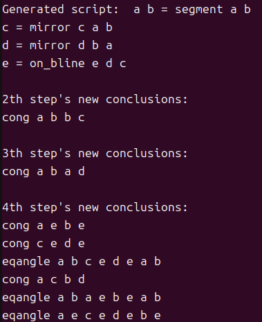
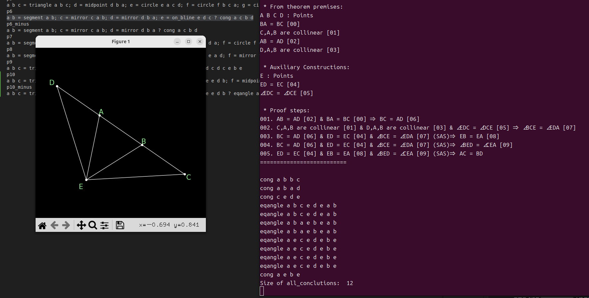
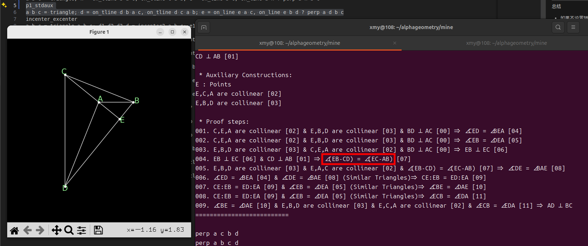
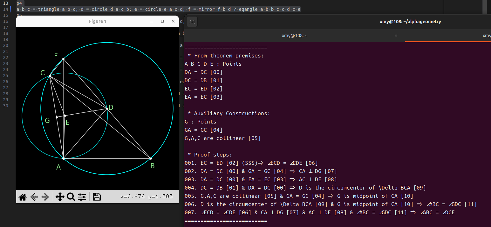

# Code

[项目链接](https://github.com/google-deepmind/alphageometry)

fixed：numericals.py	check_cyclic	(a, b, c), *ps = points => a, b, c, *ps = points


# Method

[论文概要](https://zhuanlan.zhihu.com/p/679166024)


# AlphaGeometry Syntax

[解读1（from知乎）](https://www.zhihu.com/question/640049082)

[解读2（from谷歌共享文档）](https://docs.google.com/document/d/1K4QspqnGFCJ9hpFyPUvaJXE7SAWbt3XRBBtyXzGhsOo/edit?tab=t.0)

[解读3（from某github项目）](https://github.com/tpgh24/ag4masses?tab=readme-ov-file#the-problem-definition-language)


原语：

`coll a b c` : points `a b c` are collinear

`cong a b c e` : segments `ab` and `cd` are congruent (length equal)

`contri a b c p q r` : triangles `abc` and `pqr` are congruent

`cyclic a b c d` : 4 points `a b c d` are cocyclic

`eqangle a b c d p q r s` : the angles between lines `ab-cd` and `pq-rs` are equal. **Note that angles have directions (signs)** so the order between `a b` and `c d` matters. `eqangle a b c d c d a b` is false. The way to think about it is, angle `ab-cd` is the angle to turn line `ab` **clockwise** so it is parallel with the line `cd`. You can use counter-clockwise as the convention too, as long as for all angles the same convention is used

`eqratio a b c d p q r s` : segment length `ab/cd = pq/rs`

`midp m a b` : point `m` is the midpoint of `a` and `b`

`para a b c d` : segments `ab` and `cd` are parallel

`perp a b c d` : segments `ab` and `cd` are perpendicular to each other

`simtri a b c p q r` : triangles `abc` and `pqr` are similar


DD推导的公式基于`rules.txt`：

```
perp A B C D, perp C D E F, ncoll A B E => para A B E F		# AB ⊥ CD, CD ⊥ EF, ABE不共线 => AB // EF
cong O A O B, cong O B O C, cong O C O D => cyclic A B C D	# OA = OB, OB = OC, OC = OD => ABCD共圆
eqangle A B P Q C D P Q => para A B C D
cyclic A B P Q => eqangle P A P B Q A Q B
......
```

所有的操作都记录在`defs.txt`中，[操作表](https://github.com/tpgh24/ag4masses/blob/main/data/ag_defs.jpg)：

六行为一组：`construction, rely, deps, basics, numerics, _ = data.split('\n')`

```
angle_mirror x a b c			# 对角abc以bc为对称轴作镜像反转
x : a b c x						# x由abcx决定
a b c = ncoll a b c				# abc需要满足的条件
x : eqangle b a b c b c b x		# ∠abc = ∠xbc
amirror a b c					# 另一种表示

circle x a b c					# 定义x为由abc确定的圆的圆心
x : a b c
a b c = ncoll a b c
x : cong x a x b, cong x b x c	# xa = xb = xc
bline a b, bline a c			# bline代表中垂线，这句是第一句的另一种表示
......
```

点+ '=' + 1-2个操作 => 点的构造，点的构造间用分号分隔。以一道证明垂心的题举例：

```
orthocenter
a b c = triangle; h = on_tline b a c, on_tline c a b ? perp a h b c
# abc为一三角形；hb ⊥ ac 并且 hc ⊥ ab。证明ha垂直bc
```

tips：

空格敏感，出现一个多余空格，哪怕不是在当前题目中，也会无法运行


# Configuration

[issue：GPU用不了](https://github.com/google-deepmind/alphageometry/issues/101)

`meliad`库需要`git checkout e8af054`


# Data Generation

## 随机生成图

`image_generate.py`将常用的一些操作分为三类调用，除了第一句的`segment a b`或`triangle a b c`外，剩下每轮加一个点，每个点用以下三类调用中的其中一种生成

第三类调用较为特殊，可以通过生成两个条件，即两条线唯一确定一个点，也可以只生成一个条件，表明点在这条线上。

```
calls1 = ["circle"]               # 3 点 → 点
calls2 = ["midpoint", "mirror"]   # 2 点 → 点
calls3 = ["on_line","on_tline","on_bline","on_circle","on_pline"]  # 2 点 → 线
```


## 可视化

`draw.py` 利用 `DDAR` 中提供的 `graph` 等模块用于可视化，便于debug。由于上面的随机生成图不是一道完整的题目，没有证明目标 `goal` ，所以自然不能 `write_solution` 和结合 `premises` 和 `goal` 检验题目的正确性，`graph.py` 内 `build_problem`对应的部分要注释掉。


## 加入发现辅助点模块

随机生成的图是依次加点实现的，在加点过程中，如果产生了新的结论，且新的结论中包含的点不含这个新加的点，说明新点是辅助点。

`ddar.get_proof_steps` 等地方提供的方法只能由 `goal` 出发生成依赖关系，但由前文所述，随机生成的内容不包含 `goal`，自己手动造结论很可能出现冲突导致异常，造出正确且不是条件中的结论很难，急需一个遍历所有结论的方法。

如果对 `trace_back.py` `geometry.py`等代码有足够深的理解可能可以直接调用其数据结构，我能想到的替代方案是在 `graph.py` 中 `add_algebra` 中加一句 `self.all_conclusions.append([name] + [a.name for a in args])`，可以收集所有可达结论（后面提到这里的结论是假的，不全的）。

然后便遇到了同构问题，在规定其格式后解决，但依然会有“假”辅助点。因为DDAR虽然是一直运行到结论形成闭包，但内部并不是将所有结论存起来，而是将父类`Node` 分为 `Point,Line,Angle` 等子类，所谓的闭包是说这些子类之间无法产生新的结论。只能通过 `check` 得到单对 `Node` 之间的关系。不过这个问题只要调用 `write_solution` 进行进一步检验即可，在输出证明过程的时候会输出其中的辅助点，不为空即可行。

之后又碰到一个新问题，即便 DDAR 引擎判为辅助点也不代表这个点非加不可，只能是这个证明中必须要这个点，删掉以后就不成立；实际的辅助点需要对于任意证明都需要加这样一个新的点。不过这样训出来的模型可以添加 DDAR 认为是辅助点的点。

TODO：用枚举方法生成结论，生成更高质量的数据


## 生成数据


## 训练模型

[OpenNMT](https://github.com/OpenNMT/OpenNMT-py)

# Encoutered problems

- 有`AB = BC, AB = AD`，但无`AC = BD`。这里的发现让我多一层检查：将最新加的点删除如果依然能证明说明这个点不算辅助点。





- 垂心的结论去掉以后，光由DDAR推导无法推到该结论，说明结论应当通过枚举获得。


- 这里的`∠(EB-CD) = ∠(EC-AB)`是对的，开始搞错了



- 能训出让DDAR认为是辅助点的辅助点添加建议


